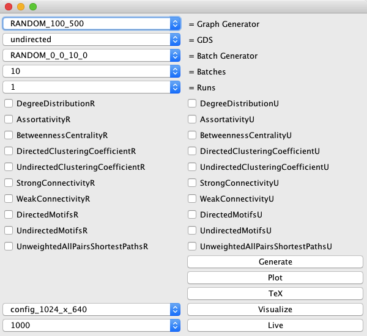
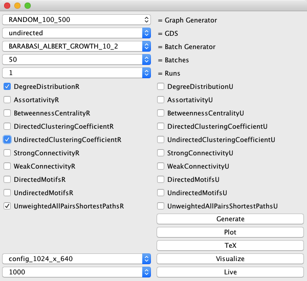
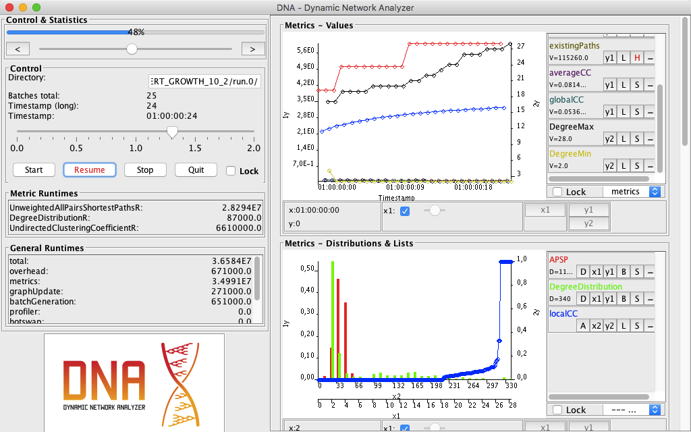
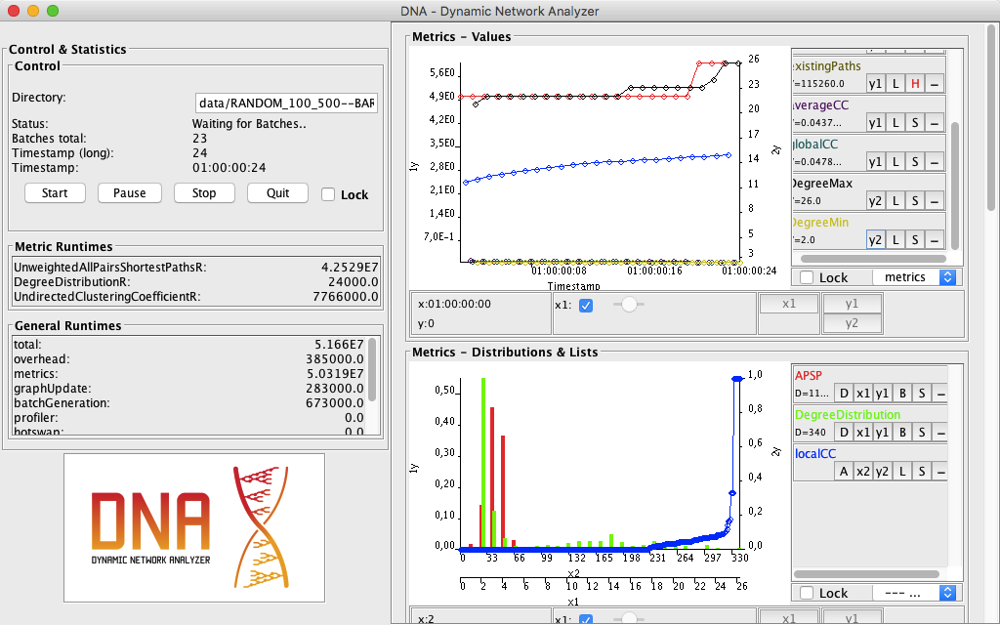

# DNA.demo

## file structure

	|- build (ant build files and build jar)
	|- java (java source files and eclipse project files)

## executing the demo

The demo can be executed as follows:

	cd build/
	java -jar dna-demo.jar

or by simply using the `demo.sh` script:

	cd build/
	./demo.sh

## the demo

The top 5 dropdowns are used to configure the series:

1. what should the initial graph be (*Graph Generator*)
2. what kind of graph is it (*GDS*)
3. how should the dynamics be generated (*Batch Generator*)
4. how many batches should be generated (*Batches*)
5. how many runs / repetiations should be executed (*Runs*)

The checkboxes below can be used to enable the computation of various metrics, e.g., DegreeDistributionR or StrongConnectivityU.

The lower dropdowns are only relevant for visualization.
In the first one, the resolution of the visualization ui should be given.
The second one is only rewuired when executing the live demo.
The number given here are the miliseconds each batch should at least take (to slow down analysis to display results over time).

The buttons in the lower right start the demo in one of five different types:

### Generate
The described series is executed and results written to the filesystem.

### Plot
Assuming that the described series was already generated, the results are plotted using gnuplot.

### TeX
A tex file containing plots and statistics for the series is generated.

### Live
The series is generated and the results visualized at the same time.
In contrast to Visualize, the timing depends on the generation (lower left dropdown for the delay).

### Visualize
The generated results are visualized.
Since the results already exists, the timing can be changed, the visualization paused, and jumped between states.

## example

### Generate

results: [example/RANDOM_100_500--BARABASI_ALBERT_GROWTH_10_2/](example/RANDOM_100_500--BARABASI_ALBERT_GROWTH_10_2/)

log output:

	~ ~ ~ ~ ~ ~ ~ ~ ~ ~ ~ ~ ~ ~ ~
	~ GENERATE
	~ ~ ~ ~ ~ ~ ~ ~ ~ ~ ~ ~ ~ ~ ~
	~ gg:      RANDOM_100_500
	~ bg:      BARABASI_ALBERT_GROWTH_10_2
	~ batches: 50
	~ runs:    1
	~ ~ ~ ~ ~ ~ ~ ~ ~ ~ ~ ~ ~ ~ ~
	~ ~ ~ ~ ~ ~ ~ ~ ~ ~ ~ ~ ~ ~ ~
	~ generating series
	~ ~ ~ ~ ~ ~ ~ ~ ~ ~ ~ ~ ~ ~ ~
	~ ds = GlobalNodeList=DHashMap;GlobalEdgeList=DHashMap;LocalNodeList=DHashMap;LocalEdgeList=DHashMap;LocalInEdgeList=DHashMap;LocalOutEdgeList=DHashMap
	~ gg = UndirectedRandomGraph N=100 E=500
	~ bg = BarabasiAlbertBatch nodes=10 m=2
	~ ag = enabled
	~ r  = files
	~ b  = files
	~ p  = data/RANDOM_100_500--BARABASI_ALBERT_GROWTH_10_2/
	~ m  = DegreeDistributionR
	~      UndirectedClusteringCoefficientR
	~      UnweightedAllPairsShortestPathsR
	~ ~ ~ ~ ~ ~ ~ ~ ~ ~ ~ ~ ~ ~ ~
	~ run 0 (50 batches)
	~     generating graph
	~     initial data
	~     B 0 -> 1 (10,0,0/20,0,0)
	~     B 1 -> 2 (10,0,0/20,0,0)
	~     B 2 -> 3 (10,0,0/20,0,0)
	~     B 3 -> 4 (10,0,0/20,0,0)
	~     B 4 -> 5 (10,0,0/20,0,0)
	~     B 5 -> 6 (10,0,0/20,0,0)
	~     B 6 -> 7 (10,0,0/20,0,0)
	~     B 7 -> 8 (10,0,0/20,0,0)
	~     B 8 -> 9 (10,0,0/20,0,0)
	~     B 9 -> 10 (10,0,0/20,0,0)
	~     B 10 -> 11 (10,0,0/20,0,0)
	~     B 11 -> 12 (10,0,0/20,0,0)
	~     B 12 -> 13 (10,0,0/20,0,0)
	~     B 13 -> 14 (10,0,0/20,0,0)
	~     B 14 -> 15 (10,0,0/20,0,0)
	~     B 15 -> 16 (10,0,0/20,0,0)
	~     B 16 -> 17 (10,0,0/20,0,0)
	~     B 17 -> 18 (10,0,0/20,0,0)
	~     B 18 -> 19 (10,0,0/20,0,0)
	~     B 19 -> 20 (10,0,0/20,0,0)
	~     B 20 -> 21 (10,0,0/20,0,0)
	~     B 21 -> 22 (10,0,0/20,0,0)
	~     B 22 -> 23 (10,0,0/20,0,0)
	~     B 23 -> 24 (10,0,0/20,0,0)
	~     B 24 -> 25 (10,0,0/20,0,0)
	~     B 25 -> 26 (10,0,0/20,0,0)
	~     B 26 -> 27 (10,0,0/20,0,0)
	~     B 27 -> 28 (10,0,0/20,0,0)
	~     B 28 -> 29 (10,0,0/20,0,0)
	~     B 29 -> 30 (10,0,0/20,0,0)
	~     B 30 -> 31 (10,0,0/20,0,0)
	~     B 31 -> 32 (10,0,0/20,0,0)
	~     B 32 -> 33 (10,0,0/20,0,0)
	~     B 33 -> 34 (10,0,0/20,0,0)
	~     B 34 -> 35 (10,0,0/20,0,0)
	~     B 35 -> 36 (10,0,0/20,0,0)
	~     B 36 -> 37 (10,0,0/20,0,0)
	~     B 37 -> 38 (10,0,0/20,0,0)
	~     B 38 -> 39 (10,0,0/20,0,0)
	~     B 39 -> 40 (10,0,0/20,0,0)
	~     B 40 -> 41 (10,0,0/20,0,0)
	~     B 41 -> 42 (10,0,0/20,0,0)
	~     B 42 -> 43 (10,0,0/20,0,0)
	~     B 43 -> 44 (10,0,0/20,0,0)
	~     B 44 -> 45 (10,0,0/20,0,0)
	~     B 45 -> 46 (10,0,0/20,0,0)
	~     B 46 -> 47 (10,0,0/20,0,0)
	~     B 47 -> 48 (10,0,0/20,0,0)
	~     B 48 -> 49 (10,0,0/20,0,0)
	~     B 49 -> 50 (10,0,0/20,0,0)
	~ 4746.142 msec / 4.746142 sec
	~ ~ ~ ~ ~ ~ ~ ~ ~ ~ ~ ~ ~ ~ ~
	~ aggregating data for run 0
	~ 	Batch: 0 (memory: 8.874191284179688)
	~ 	Batch: 1 (memory: 6.595703125)
	~ 	Batch: 2 (memory: 5.890419006347656)
	~ 	Batch: 3 (memory: 5.936737060546875)
	~ 	Batch: 4 (memory: 5.9860382080078125)
	~ 	Batch: 5 (memory: 6.036140441894531)
	~ 	Batch: 6 (memory: 5.9023590087890625)
	~ 	Batch: 7 (memory: 5.9564056396484375)
	~ 	Batch: 8 (memory: 6.012321472167969)
	~ 	Batch: 9 (memory: 6.070106506347656)
	~ 	Batch: 10 (memory: 5.913185119628906)
	~ 	Batch: 11 (memory: 5.974708557128906)
	~ 	Batch: 12 (memory: 6.038299560546875)
	~ 	Batch: 13 (memory: 6.104118347167969)
	~ 	Batch: 14 (memory: 5.924568176269531)
	~ 	Batch: 15 (memory: 5.9941558837890625)
	~ 	Batch: 16 (memory: 6.0658111572265625)
	~ 	Batch: 17 (memory: 6.1395416259765625)
	~ 	Batch: 18 (memory: 5.9355926513671875)
	~ 	Batch: 19 (memory: 6.013465881347656)
	~ 	Batch: 20 (memory: 6.093208312988281)
	~ 	Batch: 21 (memory: 6.1748199462890625)
	~ 	Batch: 22 (memory: 5.946815490722656)
	~ 	Batch: 23 (memory: 6.0323638916015625)
	~ 	Batch: 24 (memory: 6.119781494140625)
	~ 	Batch: 25 (memory: 6.2092742919921875)
	~ 	Batch: 26 (memory: 5.9576416015625)
	~ 	Batch: 27 (memory: 6.0510711669921875)
	~ 	Batch: 28 (memory: 6.146598815917969)
	~ 	Batch: 29 (memory: 6.243766784667969)
	~ 	Batch: 30 (memory: 5.968894958496094)
	~ 	Batch: 31 (memory: 6.07000732421875)
	~ 	Batch: 32 (memory: 6.1729888916015625)
	~ 	Batch: 33 (memory: 6.278038024902344)
	~ 	Batch: 34 (memory: 5.979713439941406)
	~ 	Batch: 35 (memory: 6.0885009765625)
	~ 	Batch: 36 (memory: 6.19915771484375)
	~ 	Batch: 37 (memory: 6.311683654785156)
	~ 	Batch: 38 (memory: 5.991096496582031)
	~ 	Batch: 39 (memory: 6.10736083984375)
	~ 	Batch: 40 (memory: 6.225700378417969)
	~ 	Batch: 41 (memory: 6.345909118652344)
	~ 	Batch: 42 (memory: 6.0021209716796875)
	~ 	Batch: 43 (memory: 6.1262664794921875)
	~ 	Batch: 44 (memory: 6.252281188964844)
	~ 	Batch: 45 (memory: 6.38037109375)
	~ 	Batch: 46 (memory: 6.012947082519531)
	~ 	Batch: 47 (memory: 6.144775390625)
	~ 	Batch: 48 (memory: 6.278472900390625)
	~ 	Batch: 49 (memory: 6.414039611816406)
	~ 	Batch: 50 (memory: 6.023567199707031)
	~ Aggregation: 2606.96 msec / 2.60696 sec
	~ ~ ~ ~ ~ ~ ~ ~ ~ ~ ~ ~ ~ ~ ~
	~ total time for seriesGeneration: 7421.766 msec / 7.421766 sec
	~ ~ ~ ~ ~ ~ ~ ~ ~ ~ ~ ~ ~ ~ ~

### Plot

results: [example/RANDOM_100_500--BARABASI_ALBERT_GROWTH_10_2--plots/](example/RANDOM_100_500--BARABASI_ALBERT_GROWTH_10_2--plots/)

log output:

	~ ~ ~ ~ ~ ~ ~ ~ ~ ~ ~ ~ ~ ~ ~
	~ PLOT
	~ ~ ~ ~ ~ ~ ~ ~ ~ ~ ~ ~ ~ ~ ~
	~ gg:      RANDOM_100_500
	~ bg:      BARABASI_ALBERT_GROWTH_10_2
	~ batches: 50
	~ runs:    1
	~ ~ ~ ~ ~ ~ ~ ~ ~ ~ ~ ~ ~ ~ ~
	~ ~ ~ ~ ~ ~ ~ ~ ~ ~ ~ ~ ~ ~ ~
	~ plotting data from 1 series to data/RANDOM_100_500--BARABASI_ALBERT_GROWTH_10_2--plots/
	~ ~ ~ ~ ~ ~ ~ ~ ~ ~ ~ ~ ~ ~ ~
	~ Plotting batches:
	~ 	batch.0
	~ 	batch.1
	~ 	batch.2
	~ 	batch.3
	~ 	...
	~ 	batch.50
	~ ~ ~ ~ ~ ~ ~ ~ ~ ~ ~ ~ ~ ~ ~
	~ Checking for unnecessary custom plots:
	~ 	removing: 'z.statistics.hotswap'
	~ 	removing: '__ParallelMetrics-nodesPerPartition'
	~ 	removing: '__ParallelMetrics-edgesPerPartition'
	~ 	removing: '__ParallelMetrics-externalEdgesPerPartition'
	~ 	removing: '__ParallelMetrics-auxiliaryEdgesPerPartition'
	~ 	removing: '__ParallelMetrics-auxiliaryNodesPerPartition'
	~ 	removing: '__ParallelMetrics-partitions'
	~ 	removing: '__ParallelMetrics-runtimeCollation'
	~ 	removing: '__ParallelMetrics-runtimeEstimated'
	~ 	removing: 'WorkloadMetric.InitDuration'
	~ 	removing: 'WorkloadMetric.WorkloadDuration'
	~ 	removing: 'UnweightedAllPairsShortestPathsU.connectivity'
	~ 	removing: 'UndirectedMotifsU.ALL'
	~ 	removing: 'UndirectedMotifsU.ALL.abs'
	~ 	removing: 'UndirectedMotifsU.CLASSES'
	~ 	removing: 'UndirectedMotifsU.CLASSES.abs'
	~ 	removing: 'UndirectedMotifsR.ALL'
	~ 	removing: 'UndirectedMotifsR.ALL.abs'
	~ 	removing: 'UndirectedMotifsR.CLASSES'
	~ 	removing: 'UndirectedMotifsR.CLASSES.abs'
	~ 	removing: 'DirectedMotifsU.ALL'
	~ 	removing: 'DirectedMotifsU.ALL.abs'
	~ 	removing: 'DirectedMotifsU.CLASSES1'
	~ 	removing: 'DirectedMotifsU.CLASSES2'
	~ 	removing: 'DirectedMotifsR.ALL'
	~ 	removing: 'DirectedMotifsR.ALL.abs'
	~ 	removing: 'DirectedMotifsR.CLASSES1'
	~ 	removing: 'DirectedMotifsR.CLASSES2'
	~ 	removing: 'DirectedMotifsURuleBased.ALL'
	~ 	removing: 'DirectedMotifsURuleBased.ALL.abs'
	~ 	removing: 'DirectedMotifsURuleBased.CLASSES1'
	~ 	removing: 'DirectedMotifsURuleBased.CLASSES2'
	~ 	removing: 'UndirectedMotifsPerNodesR--combined'
	~ ~ ~ ~ ~ ~ ~ ~ ~ ~ ~ ~ ~ ~ ~
	~ Plotting Custom-Statistic-Plots:
	~ 	plotting 'Nodes'
	~ 	plotting 'Edges'
	~ 	plotting 'Memory'
	~ 	plotting 'Node Updates'
	~ 	plotting 'Edge Updates'
	~ ~ ~ ~ ~ ~ ~ ~ ~ ~ ~ ~ ~ ~ ~
	~ Plotting Custom-Value-Plots:
	~ ~ ~ ~ ~ ~ ~ ~ ~ ~ ~ ~ ~ ~ ~
	~ Plotting Custom-Runtime-Plots:
	~ 	plotting 'All Runtimes'
	~ 	plotting 'Total Runtime'
	~ 	plotting 'Metric Runtimes'
	~ 	plotting 'All Metric Runtimes'
	~ 	plotting 'Graph Update Runtime'
	~ 	plotting 'Batch Generation Runtime'
	~ ~ ~ ~ ~ ~ ~ ~ ~ ~ ~ ~ ~ ~ ~
	~ Plotting metric UnweightedAllPairsShortestPathsR
	~ 	plotting 'diameter'
	~ 	plotting 'possiblePaths'
	~ 	plotting 'characteristicPathLength'
	~ 	skipping 'UnweightedAllPairsShortestPathsR.existingPaths'
	~ 		->  replaced by customplot 'UnweightedAllPairsShortestPathsR.connectivity'
	~ ~ ~ ~ ~ ~ ~ ~ ~ ~ ~ ~ ~ ~ ~
	~ Plotting metric UndirectedClusteringCoefficientR
	~ 	plotting 'averageCC'
	~ 	plotting 'globalCC'
	~ ~ ~ ~ ~ ~ ~ ~ ~ ~ ~ ~ ~ ~ ~
	~ Plotting metric DegreeDistributionR
	~ 	plotting 'DegreeMax'
	~ 	plotting 'DegreeMin'
	~ ~ ~ ~ ~ ~ ~ ~ ~ ~ ~ ~ ~ ~ ~
	~ Plotting Custom-MetricValue-Plots:
	~ 	plotting 'UnweightedAllPairsShortestPathsR.connectivity'
	~ ~ ~ ~ ~ ~ ~ ~ ~ ~ ~ ~ ~ ~ ~
	~ 
	~ Finished first plotting attempt
	~ 	used memory: 13.915855407714844
	~ 
	~ Erasing unsused data
	~ 	removed: 3.230133056640625
	~ 	used memory (new): 10.685722351074219
	~ 
	~ ~ ~ ~ ~ ~ ~ ~ ~ ~ ~ ~ ~ ~ ~
	~ Sequentially plotting Distributions and / or NodeValueLists
	~ 
	~ ~ ~ ~ ~ ~ ~ ~ ~ ~ ~ ~ ~ ~ ~
	~ Plotting metric UnweightedAllPairsShortestPathsR
	~ 	plotting distribution 'APSP'
	~ ~ ~ ~ ~ ~ ~ ~ ~ ~ ~ ~ ~ ~ ~
	~ Plotting metric UndirectedClusteringCoefficientR
	~ 	plotting nodevaluelist 'localCC'
	~ ~ ~ ~ ~ ~ ~ ~ ~ ~ ~ ~ ~ ~ ~
	~ Plotting metric DegreeDistributionR
	~ 	plotting distribution 'DegreeDistribution'
	~ Plotting finished!

### TeX

results: [example/RANDOM_100_500--BARABASI_ALBERT_GROWTH_10_2--tex/](example/RANDOM_100_500--BARABASI_ALBERT_GROWTH_10_2--tex/)

log output:

	~ ~ ~ ~ ~ ~ ~ ~ ~ ~ ~ ~ ~ ~ ~
	~ TEX
	~ ~ ~ ~ ~ ~ ~ ~ ~ ~ ~ ~ ~ ~ ~
	~ gg:      RANDOM_100_500
	~ bg:      BARABASI_ALBERT_GROWTH_10_2
	~ batches: 50
	~ runs:    1
	~ ~ ~ ~ ~ ~ ~ ~ ~ ~ ~ ~ ~ ~ ~
	~ ~ ~ ~ ~ ~ ~ ~ ~ ~ ~ ~ ~ ~ ~
	~ plotting data from 1 series to data/RANDOM_100_500--BARABASI_ALBERT_GROWTH_10_2--tex/plots/
	~ ~ ~ ~ ~ ~ ~ ~ ~ ~ ~ ~ ~ ~ ~
	~ Plotting batches:
	~ 	batch.0
	~ 	batch.1
	~ 	batch.2
	~ 	batch.3
	~ 	...
	~ 	batch.50
	~ ~ ~ ~ ~ ~ ~ ~ ~ ~ ~ ~ ~ ~ ~
	~ Checking for unnecessary custom plots:
	~ 	removing: 'z.statistics.hotswap'
	~ 	removing: '__ParallelMetrics-nodesPerPartition'
	~ 	removing: '__ParallelMetrics-edgesPerPartition'
	~ 	removing: '__ParallelMetrics-externalEdgesPerPartition'
	~ 	removing: '__ParallelMetrics-auxiliaryEdgesPerPartition'
	~ 	removing: '__ParallelMetrics-auxiliaryNodesPerPartition'
	~ 	removing: '__ParallelMetrics-partitions'
	~ 	removing: '__ParallelMetrics-runtimeCollation'
	~ 	removing: '__ParallelMetrics-runtimeEstimated'
	~ 	removing: 'WorkloadMetric.InitDuration'
	~ 	removing: 'WorkloadMetric.WorkloadDuration'
	~ 	removing: 'UnweightedAllPairsShortestPathsU.connectivity'
	~ 	removing: 'UndirectedMotifsU.ALL'
	~ 	removing: 'UndirectedMotifsU.ALL.abs'
	~ 	removing: 'UndirectedMotifsU.CLASSES'
	~ 	removing: 'UndirectedMotifsU.CLASSES.abs'
	~ 	removing: 'UndirectedMotifsR.ALL'
	~ 	removing: 'UndirectedMotifsR.ALL.abs'
	~ 	removing: 'UndirectedMotifsR.CLASSES'
	~ 	removing: 'UndirectedMotifsR.CLASSES.abs'
	~ 	removing: 'DirectedMotifsU.ALL'
	~ 	removing: 'DirectedMotifsU.ALL.abs'
	~ 	removing: 'DirectedMotifsU.CLASSES1'
	~ 	removing: 'DirectedMotifsU.CLASSES2'
	~ 	removing: 'DirectedMotifsR.ALL'
	~ 	removing: 'DirectedMotifsR.ALL.abs'
	~ 	removing: 'DirectedMotifsR.CLASSES1'
	~ 	removing: 'DirectedMotifsR.CLASSES2'
	~ 	removing: 'DirectedMotifsURuleBased.ALL'
	~ 	removing: 'DirectedMotifsURuleBased.ALL.abs'
	~ 	removing: 'DirectedMotifsURuleBased.CLASSES1'
	~ 	removing: 'DirectedMotifsURuleBased.CLASSES2'
	~ 	removing: 'UndirectedMotifsPerNodesR--combined'
	~ ~ ~ ~ ~ ~ ~ ~ ~ ~ ~ ~ ~ ~ ~
	~ Plotting Custom-Statistic-Plots:
	~ 	plotting 'Nodes'
	~ 	plotting 'Edges'
	~ 	plotting 'Memory'
	~ 	plotting 'Node Updates'
	~ 	plotting 'Edge Updates'
	~ ~ ~ ~ ~ ~ ~ ~ ~ ~ ~ ~ ~ ~ ~
	~ Plotting Custom-Value-Plots:
	~ ~ ~ ~ ~ ~ ~ ~ ~ ~ ~ ~ ~ ~ ~
	~ Plotting Custom-Runtime-Plots:
	~ 	plotting 'All Runtimes'
	~ 	plotting 'Total Runtime'
	~ 	plotting 'Metric Runtimes'
	~ 	plotting 'All Metric Runtimes'
	~ 	plotting 'Graph Update Runtime'
	~ 	plotting 'Batch Generation Runtime'
	~ ~ ~ ~ ~ ~ ~ ~ ~ ~ ~ ~ ~ ~ ~
	~ Plotting metric UnweightedAllPairsShortestPathsR
	~ 	plotting 'diameter'
	~ 	plotting 'possiblePaths'
	~ 	plotting 'characteristicPathLength'
	~ 	skipping 'UnweightedAllPairsShortestPathsR.existingPaths'
	~ 		->  replaced by customplot 'UnweightedAllPairsShortestPathsR.connectivity'
	~ ~ ~ ~ ~ ~ ~ ~ ~ ~ ~ ~ ~ ~ ~
	~ Plotting metric UndirectedClusteringCoefficientR
	~ 	plotting 'averageCC'
	~ 	plotting 'globalCC'
	~ ~ ~ ~ ~ ~ ~ ~ ~ ~ ~ ~ ~ ~ ~
	~ Plotting metric DegreeDistributionR
	~ 	plotting 'DegreeMax'
	~ 	plotting 'DegreeMin'
	~ ~ ~ ~ ~ ~ ~ ~ ~ ~ ~ ~ ~ ~ ~
	~ Plotting Custom-MetricValue-Plots:
	~ 	plotting 'UnweightedAllPairsShortestPathsR.connectivity'
	~ ~ ~ ~ ~ ~ ~ ~ ~ ~ ~ ~ ~ ~ ~
	~ 
	~ Finished first plotting attempt
	~ 	used memory: 22.483612060546875
	~ 
	~ Erasing unsused data
	~ 	removed: 11.799415588378906
	~ 	used memory (new): 10.684196472167969
	~ 
	~ ~ ~ ~ ~ ~ ~ ~ ~ ~ ~ ~ ~ ~ ~
	~ Sequentially plotting Distributions and / or NodeValueLists
	~ 
	~ ~ ~ ~ ~ ~ ~ ~ ~ ~ ~ ~ ~ ~ ~
	~ Plotting metric UnweightedAllPairsShortestPathsR
	~ 	plotting distribution 'APSP'
	~ ~ ~ ~ ~ ~ ~ ~ ~ ~ ~ ~ ~ ~ ~
	~ Plotting metric UndirectedClusteringCoefficientR
	~ 	plotting nodevaluelist 'localCC'
	~ ~ ~ ~ ~ ~ ~ ~ ~ ~ ~ ~ ~ ~ ~
	~ Plotting metric DegreeDistributionR
	~ 	plotting distribution 'DegreeDistribution'
	~ Plotting finished!
	~ ~ ~ ~ ~ ~ ~ ~ ~ ~ ~ ~ ~ ~ ~
	~ Exporting series 'RANDOM_100_500 - BARABASI_ALBERT_GROWTH_10_2' at 'data/RANDOM_100_500--BARABASI_ALBERT_GROWTH_10_2/' to 'data/RANDOM_100_500--BARABASI_ALBERT_GROWTH_10_2--tex/__analysis.tex'
	~ Latex-Output finished!

### Visualize

log output:

	~ ~ ~ ~ ~ ~ ~ ~ ~ ~ ~ ~ ~ ~ ~
	~ VISUALIZE
	~ ~ ~ ~ ~ ~ ~ ~ ~ ~ ~ ~ ~ ~ ~
	~ gg:      RANDOM_100_500
	~ bg:      BARABASI_ALBERT_GROWTH_10_2
	~ batches: 50
	~ runs:    1
	~ ~ ~ ~ ~ ~ ~ ~ ~ ~ ~ ~ ~ ~ ~
	~ ~ ~ ~ ~ ~ ~ ~ ~ ~ ~ ~ ~ ~ ~
	~ Loading default config from inside .jar-file: 'gui_default.cfg'
	~ Loading config from inside .jar-file: 'config_1024_x_640.cfg'
	~ Config 'config_1024_x_640.cfg' was not found in .jar-file. Checking 'config/vis/config_1024_x_640.cfg'
	~ ~ ~ ~ ~ ~ ~ ~ ~ ~ ~ ~ ~ ~ ~
	~ Initializing MainDisplay
	creating batchhandler at data/RANDOM_100_500--BARABASI_ALBERT_GROWTH_10_2/run.0/	dna.visualization.MainDisplay[frame2,208,139,1024x640,invalid,hidden,layout=java.awt.BorderLayout,title=DNA - Dynamic Network Analyzer,resizable,normal,defaultCloseOperation=DISPOSE_ON_CLOSE,rootPane=javax.swing.JRootPane[,0,0,0x0,invalid,layout=javax.swing.JRootPane$RootLayout,alignmentX=0.0,alignmentY=0.0,border=,flags=16777673,maximumSize=,minimumSize=,preferredSize=],rootPaneCheckingEnabled=true]	false	none
	~ Starting BatchHandler in new thread: Thread[BatchHandler-Thread0.92008114,6,main]

### Live

log output:

	~ ~ ~ ~ ~ ~ ~ ~ ~ ~ ~ ~ ~ ~ ~
	~ LIVE
	~ ~ ~ ~ ~ ~ ~ ~ ~ ~ ~ ~ ~ ~ ~
	~ gg:      RANDOM_100_500
	~ bg:      BARABASI_ALBERT_GROWTH_10_2
	~ batches: 50
	~ runs:    1
	~ ~ ~ ~ ~ ~ ~ ~ ~ ~ ~ ~ ~ ~ ~
	~ starting GENERATION thread
	~ starting VISUALIZATION thread
	~ input: data/RANDOM_100_500--BARABASI_ALBERT_GROWTH_10_2/run.0/
	~ ~ ~ ~ ~ ~ ~ ~ ~ ~ ~ ~ ~ ~ ~
	~ Loading default config from inside .jar-file: 'gui_default.cfg'
	~ Loading config from inside .jar-file: 'config_1024_x_640.cfg'
	~ Config 'config_1024_x_640.cfg' was not found in .jar-file. Checking 'config/vis/config_1024_x_640.cfg'
	~ ~ ~ ~ ~ ~ ~ ~ ~ ~ ~ ~ ~ ~ ~
	~ Initializing MainDisplay
	creating batchhandler at data/RANDOM_100_500--BARABASI_ALBERT_GROWTH_10_2/run.0/	dna.visualization.MainDisplay[frame1,208,139,1024x640,invalid,hidden,layout=java.awt.BorderLayout,title=DNA - Dynamic Network Analyzer,resizable,normal,defaultCloseOperation=DISPOSE_ON_CLOSE,rootPane=javax.swing.JRootPane[,0,0,0x0,invalid,layout=javax.swing.JRootPane$RootLayout,alignmentX=0.0,alignmentY=0.0,border=,flags=16777673,maximumSize=,minimumSize=,preferredSize=],rootPaneCheckingEnabled=true]	true	none
	~ output: data/RANDOM_100_500--BARABASI_ALBERT_GROWTH_10_2/run.0/
	~ ~ ~ ~ ~ ~ ~ ~ ~ ~ ~ ~ ~ ~ ~
	~ generating series
	~ ~ ~ ~ ~ ~ ~ ~ ~ ~ ~ ~ ~ ~ ~
	~ ds = GlobalNodeList=DHashMap;GlobalEdgeList=DHashMap;LocalNodeList=DHashMap;LocalEdgeList=DHashMap;LocalInEdgeList=DHashMap;LocalOutEdgeList=DHashMap
	~ gg = UndirectedRandomGraph N=100 E=500
	~ bg = BarabasiAlbertBatch nodes=10 m=2
	~ ag = enabled
	~ r  = files
	~ b  = files
	~ p  = data/RANDOM_100_500--BARABASI_ALBERT_GROWTH_10_2/
	~ t  = 1000 msec / batch
	~ m  = DegreeDistributionR
	~      UndirectedClusteringCoefficientR
	~      UnweightedAllPairsShortestPathsR
	~ ~ ~ ~ ~ ~ ~ ~ ~ ~ ~ ~ ~ ~ ~
	~ run 0 (50 batches)
	~     generating graph
	~     initial data
	~     B 0 -> 1 (10,0,0/20,0,0)
	~ Starting BatchHandler in new thread: Thread[BatchHandler-Thread0.7233624,6,main]
	~ ~ ~ ~ ~ ~ ~ ~ ~ ~ ~ ~ ~ ~ ~
	~ No windows operating system.. using jpathwatch-0-95 library
	~ Watching directory: 'data/RANDOM_100_500--BARABASI_ALBERT_GROWTH_10_2/run.0/'
	~     B 1 -> 2 (10,0,0/20,0,0)
	~     B 2 -> 3 (10,0,0/20,0,0)
	~     B 3 -> 4 (10,0,0/20,0,0)
	~     B 4 -> 5 (10,0,0/20,0,0)
	~     B 5 -> 6 (10,0,0/20,0,0)
	~     B 6 -> 7 (10,0,0/20,0,0)
	~     B 7 -> 8 (10,0,0/20,0,0)
	~     B 8 -> 9 (10,0,0/20,0,0)
	~     B 9 -> 10 (10,0,0/20,0,0)
	~     B 10 -> 11 (10,0,0/20,0,0)
	~     B 11 -> 12 (10,0,0/20,0,0)
	~     B 12 -> 13 (10,0,0/20,0,0)
	~     B 13 -> 14 (10,0,0/20,0,0)
	~     B 14 -> 15 (10,0,0/20,0,0)
	~     B 15 -> 16 (10,0,0/20,0,0)
	~     B 16 -> 17 (10,0,0/20,0,0)
	~     B 17 -> 18 (10,0,0/20,0,0)
	~     B 18 -> 19 (10,0,0/20,0,0)
	~     B 19 -> 20 (10,0,0/20,0,0)
	~     B 20 -> 21 (10,0,0/20,0,0)
	~     B 21 -> 22 (10,0,0/20,0,0)
	~     B 22 -> 23 (10,0,0/20,0,0)
	~     B 23 -> 24 (10,0,0/20,0,0)
	~     B 24 -> 25 (10,0,0/20,0,0)
	~     B 25 -> 26 (10,0,0/20,0,0)
	~     B 26 -> 27 (10,0,0/20,0,0)
	~     B 27 -> 28 (10,0,0/20,0,0)
	~     B 28 -> 29 (10,0,0/20,0,0)
	~     B 29 -> 30 (10,0,0/20,0,0)
	~     B 30 -> 31 (10,0,0/20,0,0)
	~     B 31 -> 32 (10,0,0/20,0,0)
	~     B 32 -> 33 (10,0,0/20,0,0)
	~     B 33 -> 34 (10,0,0/20,0,0)
	~     B 34 -> 35 (10,0,0/20,0,0)
	~     B 35 -> 36 (10,0,0/20,0,0)
	~     B 36 -> 37 (10,0,0/20,0,0)
	~     B 37 -> 38 (10,0,0/20,0,0)
	~     B 38 -> 39 (10,0,0/20,0,0)
	~     B 39 -> 40 (10,0,0/20,0,0)
	~     B 40 -> 41 (10,0,0/20,0,0)
	~     B 41 -> 42 (10,0,0/20,0,0)
	~     B 42 -> 43 (10,0,0/20,0,0)
	~     B 43 -> 44 (10,0,0/20,0,0)
	~     B 44 -> 45 (10,0,0/20,0,0)
	~     B 45 -> 46 (10,0,0/20,0,0)
	~     B 46 -> 47 (10,0,0/20,0,0)
	~     B 47 -> 48 (10,0,0/20,0,0)
	~     B 48 -> 49 (10,0,0/20,0,0)
	~     B 49 -> 50 (10,0,0/20,0,0)
	~ 53369.405 msec / 53.369405 sec
	~ ~ ~ ~ ~ ~ ~ ~ ~ ~ ~ ~ ~ ~ ~
	~ aggregating data for run 0
	~ 	Batch: 0 (memory: 19.54547119140625)
	~ 	Batch: 1 (memory: 21.200767517089844)
	~ 	Batch: 2 (memory: 15.957054138183594)
	~ 	Batch: 3 (memory: 16.075340270996094)
	~ 	Batch: 4 (memory: 15.436767578125)
	~ 	Batch: 5 (memory: 15.480751037597656)
	~ 	Batch: 6 (memory: 15.533454895019531)
	~ 	Batch: 7 (memory: 15.588027954101562)
	~ 	Batch: 8 (memory: 15.440505981445312)
	~ 	Batch: 9 (memory: 15.498786926269531)
	~ 	Batch: 10 (memory: 15.565818786621094)
	~ 	Batch: 11 (memory: 15.621017456054688)
	~ 	Batch: 12 (memory: 15.44915771484375)
	~ 	Batch: 13 (memory: 15.516914367675781)
	~ 	Batch: 14 (memory: 15.584541320800781)
	~ 	Batch: 15 (memory: 15.660919189453125)
	~ 	Batch: 16 (memory: 15.461944580078125)
	~ 	Batch: 17 (memory: 15.535377502441406)
	~ 	Batch: 18 (memory: 15.610679626464844)
	~ 	Batch: 19 (memory: 15.687881469726562)
	~ 	Batch: 20 (memory: 15.472564697265625)
	~ 	Batch: 21 (memory: 15.553474426269531)
	~ 	Batch: 22 (memory: 15.636253356933594)
	~ 	Batch: 23 (memory: 15.721290588378906)
	~ 	Batch: 24 (memory: 15.483978271484375)
	~ 	Batch: 25 (memory: 15.573188781738281)
	~ 	Batch: 26 (memory: 15.664237976074219)
	~ 	Batch: 27 (memory: 15.757156372070312)
	~ 	Batch: 28 (memory: 15.494598388671875)
	~ 	Batch: 29 (memory: 15.591453552246094)
	~ 	Batch: 30 (memory: 15.690177917480469)
	~ 	Batch: 31 (memory: 15.790977478027344)
	~ 	Batch: 32 (memory: 15.505622863769531)
	~ 	Batch: 33 (memory: 15.610359191894531)
	~ 	Batch: 34 (memory: 15.716964721679688)
	~ 	Batch: 35 (memory: 15.825439453125)
	~ 	Batch: 36 (memory: 15.516647338867188)
	~ 	Batch: 37 (memory: 15.629264831542969)
	~ 	Batch: 38 (memory: 15.743751525878906)
	~ 	Batch: 39 (memory: 15.860107421875)
	~ 	Batch: 40 (memory: 15.5274658203125)
	~ 	Batch: 41 (memory: 15.647560119628906)
	~ 	Batch: 42 (memory: 15.769523620605469)
	~ 	Batch: 43 (memory: 15.893356323242188)
	~ 	Batch: 44 (memory: 15.5380859375)
	~ 	Batch: 45 (memory: 15.665657043457031)
	~ 	Batch: 46 (memory: 15.795097351074219)
	~ 	Batch: 47 (memory: 15.926612854003906)
	~ 	Batch: 48 (memory: 15.548912048339844)
	~ 	Batch: 49 (memory: 15.684585571289062)
	~ 	Batch: 50 (memory: 15.82208251953125)
	~ Aggregation: 3535.87 msec / 3.53587 sec
	~ ~ ~ ~ ~ ~ ~ ~ ~ ~ ~ ~ ~ ~ ~
	~ total time for seriesGeneration: 56938.106 msec / 56.938106 sec
	~ ~ ~ ~ ~ ~ ~ ~ ~ ~ ~ ~ ~ ~ ~
